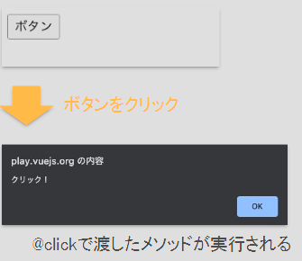
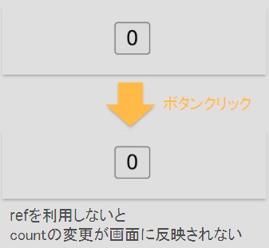
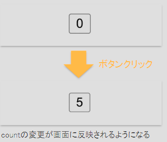
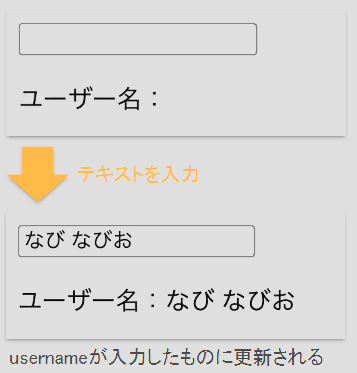
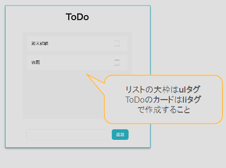

# How To Use

This template should help get you started developing with Vue 3 in Vite.

## Recommended IDE Setup

[VSCode](https://code.visualstudio.com/) + [Volar](https://marketplace.visualstudio.com/items?itemName=Vue.volar) (and disable Vetur).

## Customize configuration

See [Vite Configuration Reference](https://vitejs.dev/config/).

## Project Setup

```sh
npm install
```

### Compile and Hot-Reload for Development

```sh
npm run dev
```

### Compile and Minify for Production

```sh
npm run build
```
---

# OUTPUT
## 概要(Chapter 01)
Vue.js, HTML, CSS, JavaScriptの基礎を学ぶためのリポジトリ

### Webページの構成
- HTML
  - ページの構造を作成
- CSS
    - ページの見た目を整える
- JavaScript
    - ページの動きを制御

### Vue.jsとは
- Webページ上の要素の操作や通信処理などをシンプルな記述で行えるJavaScriptのフレームワーク

### Vue.jsの基本的な構文
- 1つのファイルに3つの言語を書く

```vue
<!--JavaScript-->
<script setup>
  import { ref } from 'vue'
  const count = ref(0)
</script> 

<!--HTML-->
<template>
  <button @click="count++">
    Count is: {{ count }}
  </button>
</template>

<!--CSS-->
<style scoped>
  button {
    font-weight: bold;
  }
</style>
```
### ここからの進め方
- サンプルコードがコピーできるので、[Vue SFC Playground](https://play.vuejs.org/#eNp9kUFLwzAUx79KfJcqzA3R0+gGKgP1oKKCl1xG99ZlpklIXmah9Lv7krLqQXbr+//+L/2l7eDWuekhIsyhDJVXjkRAim4pjWqc9SQ64XErerH1thEFVwtppKmsCSSaUItF4ufFA2ptxaf1enNWXEhTzobj+CAeCBun14Q8CVHurpZdl5f7vpzxlFNlXCRxuGzsBvVCAnMJjMrZuA0ToMCv3qp6ug/WsHWXdiVUtnFKo39xpFhNwlxkktiazb6fckY+4uSYVzusvv7J96FNmYRXjwH9ASWMjNa+Rhrw6v0ZW34eIZtHze0T8A2D1TE5DrW7aDas/aeXbR/zt1em/girltCE46WSaGr2uS+B/8f9iav/6l5Pb/KeND30P7yHphw=)で確認しながら進めよう

## HTMLの書き方(Chapter 02)
### HTMLとは
**Hyper Text Markup Language**

- Webの基本となるハイパーテキストを記述するためのマークアップ言語
  - ウェブページを作成するために開発された言語
  - 命令を書くJavaなどのプログラミング言語と違い、構造を各言語
  - Markdownに近い
- HTMLの役目は文章の中で見出し・段落・リスト等の各部分が果たしている役割をコンピュータが理解できるように構造を定義すること

### HTML要素の配置ルール
基本的にHTMLの要素は上から下へ配置される

**サンプルコード**
```html
<template>
    <div>あいうえお</div>
    <div>かきくけこ</div>
    <span>さしすせそ</span>
    <span>たちつてと</span>
</template>
```
**ブラウザ表示**
```
あいうえお <- ブロック要素(中身に関わらず横幅が親要素いっぱいに広がる)
かきくけこ
さしすせそ たちつてと　<- インライン要素(中身の幅だけ広がる)
```
### ブロック要素とインライン要素
- ブロック要素
  - 横幅が親要素いっぱいに広がる
  - 縦に並ぶ(改行あり)
  - 代表的なタグ
    - div, h1~h6, p, ul, ol, li, table, form
- インライン要素
  - 範囲は中身に応じて決まる
  - CSSで幅と高さを指定できない
  - 上下左右の余白は指定できる
  - 横に並ぶ(改行なし)
  - 代表的なタグ
    - span, a, img, input, button

### hタグ
- 見出しで利用するタグ
- h1~h6まである
- hタグは数字が小さい順(h1 -> h2 -> h3 -> ...)で利用する

**サンプルコード**
```
<h1>インターンシップ</h1>
<h2>基本編</h2>
<h3>HTML編</h3>
```

**ブラウザ表示**
> # インターンシップ
> ## 基本編
> ### HTML編

### aタグ
- href="URL"で書いたURLのページを表示する
- target="_blank"を指定すると、別タブでページで開くことができる
  - 脆弱性対策でrel="noopenerを記述する

**サンプルコード**
```html
<!-- aタグ(リンク) -->
<a href="https://www.navitime.co.jp/">NAVITIME</a>
<!-- aタグ(別タブで開く) -->
<a href="https://github.co.jp/" target="_blank" rel="noopener">GitHub</a>
```

**ブラウザ表示**
> <a href="https://www.navitime.co.jp/">NAVITIME</a>  <a href="https://github.co.jp/" target="_blank" rel="noopener">GitHub</a>

### ul, liタグ
- ulタグ
  - 箇条書きリストを作成する

- liタグ
    - リストの項目を作成する。ulタグの子要素として利用する

**サンプルコード**
```html
<!-- ulタグ(箇条書きリスト) -->
<ul>
    <!-- liタグ(リストの項目) -->
    <li>HTML</li>
    <li>CSS</li>
    <li>JavaScript</li>
</ul>
```

**ブラウザ表示**
> - HTML
> - CSS
> - JavaScript

### input, buttonタグ
- inputタグ
  - ユーザーからの入力を受け付ける
  - type属性で入力形式を指定できる
    - text, password …
- buttonタグ
  - クリックされたときに何か処理を行い場合は、JavaScriptを書く必要あり

**サンプルコード**
```html
<!-- inputタグ(テキスト入力) -->
<input type="text" placeholder="目的地を入力">
<!-- buttonタグ(ボタン) -->
<button type="button">検索</button>
```

**ブラウザ表示**
> <input type="text" placeholder="目的地を入力"> 
> <button type="button">検索</button>

## CSSの基本構造(Chapter 03)
**セレクタとプロパティ**

### CSSとは
**Cascading Style Sheets**
- Webページのスタイルを指定するためのスタイルシート言語
  - HTMLと同様に命令を書くJavaなどのプログラミング言語と違う
- HTMLで作った文書構造に対して、デザインを施し、見栄えを整える役割

### セレクタとは
- CSSによるデザイン指定をどのHTML要素に適用するのかをしていするために使われる
- JavaScriptから特定のHTML要素を対象にして処理を行いたい場所に要素を選択する目的でも使われる

### セレクタの種類
|                 | HTML                                                                                           | 指定方法                                                   | メモ                                                                                         |
|-----------------|------------------------------------------------------------------------------------------------|--------------------------------------------------------|--------------------------------------------------------------------------------------------|
| HTMLタグ指定        | ```<span>NAVITIME</span>```                                                                    | ```span{```<br/>```color: red;```<br/>```}```          | スコープが広いため、基本的に使用しない                                                                        |
| class名指定        | ```<span class="red-text">NAVITIME</span>```                                                   | ```.red-text{```<br/>```  color: red;```<br/>```}```   | classの重複はOKなので、一気に複数箇所にスタイル指定できる                                                           |
| id名指定           | ```<span id="main">NAVITIME</span>```                                                          | ```#main{```<br/>```color: red;```<br/>```}```         | 1ファイルに対して同じidは1つしか利用できない                                                                   |
| 複数のセレクタ<br/>指定  | ```<span class="red-text">NAVITIME</span>```<br/>```<span class="blue-text">NAVITIME</span>``` | ```.red-text, .blue-text{```<br/>```color: red;```<br/>```}``` | カンマ(,)でつなげると同時指定できる他にもいろいろな指定方法がある <br/>参考：https://webliker.info/css-selector-cheat-sheet/ |

### プロパティとは
- CSSで適用するスタイルの種類を指す
- セレクタで指定した要素に対して、どのような変化をさせるのかを指定する

### CSSの基本文法(プロパティ)
- font-size
  - フォントサイズを指定する
- font-weight
  - フォントの太さを指定する
- color
  - テキストの色を指定する
- background-color
  - 背景色を指定する
- width
  - 要素の横幅を指定する
- height
  - 要素の高さを指定する
- margin
  - 要素の外側の余白を指定する
- padding
  - 要素の内側の余白を指定する
- border
  - 要素の境界線(線の色、線のスタイル、線の太さ)を指定する

## スタイル指定(Chapter 04)

### styleの書き方
**サンプルコード**
```vue
<template>
<body>
  <ul>
    <li class="red">RED</li>
    <li is="blue">BLUE</li>
  </ul>
</body>
</template>

<style>
  .red {
    color: red;
  }
  
  #blue {
    color: blue;
  }
</style>
```
**ブラウザ表示**
> <body>
>  <ul>
>    <li class="red">RED</li>
>    <li id="blue">BLUE</li>
>  </ul>
> </body>
> <style>
>  .red {
>    color: red;
>  }
>  #blue {
>    color: blue;
>  }
> </style>

### 背景色を変更する
**サンプルコード**
```vue
<template>
  <ul>
    <li class="red">RED</li>
    <li id="blue">BLUE</li>
    <li class="green">GREEN</li>
    <li class="gray">GRAY</li>
  </ul>
</template>

<style>
  .red {
    color: red;
  }
  #blue {
    color: blue;
  }
  .green {
    background-color: green;
  }
  .gray {
    background-color: gray;
  }
</style>
```

**ブラウザ表示**
>   <ul>
>    <li class="red2">RED</li>
>    <li id="blue2">BLUE</li>
>    <li class="green2">GREEN</li>
>    <li class="gray2">GRAY</li>
>  </ul>
> <style>
>   .red2 {
>     color: red;
>    }
>   #blue2 {
>     color: blue;
>    }  
>   .green2 {
>     background-color: green;
>     }
>   .gray2 {
>     background-color: gray;
>    }
> </style>

### 要素の幅と高さを変更する

**サンプルコード**
```vue
<template>
  <div class="top"></div>
  <div class="middle"></div>
  <div class="bottom"></div>
</template>

<style>
//  幅が100pxで高さが100pxの指定
  .top {
    width: 100px;
    height: 100px;
    background-color: lightblue;
  }
//　幅は表示可能な領域の50％の長さに指定
  .middle {
    width: 50%;
    height: 250px;
    background-color: red;
  }
//　幅が300pxを2で割った数
  .bottom {
    width: calc(300px / 2);
    height: 150px;
    background-color: blue;
  }
</style>
```

**ブラウザ表示**
> <div class="top"></div>
> <div class="middle"></div>
> <div class="bottom"></div>
> <style>
>  .top {
>    width: 100px;
>    height: 100px;
>    background-color: lightblue;
>  }
>  .middle {
>    width: 50%;
>    height: 250px;
>    background-color: red;
>  }
>  .bottom {
>    width: calc(300px / 2);
>    height: 150px;
>    background-color: blue;
>  }
> </style>

### 要素の配置を操作する
横並びのレイアウトを作るにはどうしたらいいのか？

### Flexboxでブロック要素を横並びにする

**サンプルコード**
```vue
<template>
  <ul>
    <li>あいうえお</li>
    <li>かきくけこ</li>
    <li>さしすせそ</li>
    <li>たちつてと</li>
  </ul>
</template>

<style>
  li {
    border: solid 1px #888888;
    list-style: none;
  }
    ul {
        display: flex;
    }
</style>
```

**Before(flex指定なし)**
> <ul>
>  <li class="li">あいうえお</li>
>  <li class="li">かきくけこ</li>
>  <li class="li">さしすせそ</li>
>  <li class="li">たちつてと</li>
> </ul>
> <style>
>  .li {
>    border: solid 1px #888888;
>    list-style: none;
>  }
> </style>

**After(flex指定あり)**
> <ul class="ul1">
>  <li class="li1">あいうえお</li>
>  <li class="li1">かきくけこ</li>
>  <li class="li1">さしすせそ</li>
>  <li class="li1">たちつてと</li>
> </ul>
> <style>
>  .li1 {
>    border: solid 1px #888888;
>    list-style: none;
>  }
>  .ul1 {
>    display: flex;
>  }
> </style>

### 要素の余白のつけかた
- margin
  - 要素の外側の余白を指定する
- padding
  - 要素の内側の余白を指定する


<br/>
出典 : https://saruwakakun.com/html-css/basic/margin-padding

## JavaScriptとは(Chapter 05)

### JavaScriptとは
- Webページの動きを記述するプログラミング言語
- 要素を変更したり、通信処理を行うことができる
- ブラウザ上で動作する

## JavaScriptの基本構文(Chapter 06)

### 変数宣言
変数は、letまたはconstを用いて宣言する

|       | 特徴    |
|-------|-------|
| const | 再代入不可 |
| let   | 再代入可能 |

**サンプルコード**
```vue
let text1 = 'りんご';
alert(text1); // りんご
text1 = 'バナナ'; -> 再代入可能

const text2 = 'りんご';
alert(text2); // りんご
text2 = 'バナナ'; -> エラー(再代入不可)
```

### 主な変数の型

| 型         | 意味             |
|-----------|----------------|
| String    | 文字列('や"で囲む)    |
| Number    | 数値(整数・小数)      |
| Boolean   | 真偽値 true/false |
| undefined | 未定義状態          |
| null      | null           |

**サンプルコード**
```javascript
const a = 'Hello'; // String
const b = 1.23; // Number
const c = true; // Boolean

const d = undefined; // undefined
const e = null; // null
```
この他にも型はある

### Object連想配列(key, valueの組み)

オブジェクトは、キーとバリューの関係で成り立つ変数.キーの型でバリューにアクセスできる

**サンプルコード**
```javascript
const company = {
  name: 'NAVITIME',
  location: '東京',
  employee: 1000
};

console.log(company.name); // NAVITIME
console.log(company.id); // undefined
```

company.nameは定義されているから表示されるが、company.idは定義されていないからundefinedが表示される


### 配列

配列は、複数の値を1つのデータ（変数）として扱えることが特徴

**サンプルコード**
```javascript
const array = [1, 2, 3];
console.log(array[0]); // 1

const min = [true, 'a', 3.14];
console.log(min[1]); // a

const list = [1,2,3,4,5,6,7,8];
console.log(list.length); // 8

const items = [
  { id: 1, name: 'HTML'},
  {id: 2, name: 'CSS'},
];
console.log(items[0].id); // 1
items.forEach(function (item) { 
    console.log(item.name) // HTML, CSS
})
```

### 関数

入力に対して出力を返す処理のまとまり<br/>
関数自体のメリット：同じ処理を一つにまとめることができる

**サンプルコード**
```javascript
function sum(a, b) {
  return a + b;
}

console.log(sum(1, 2)); // 3

function get(path, params) {
  return axios.get(path + params);
}

get(path, params); // ページ読込み時やクイックイベント時に使える
```

## Vue.js

### 基本的な構文

- 1つのファイルに3つの言語を書く

**サンプルコード**
```vue
<script setup> // <- scriptタグの間にJavaScriptを記述
  import { ref } from 'vue'
  const count = ref(0)
</script>

<template>  // <- templateタグの間にHTMLを記述
  <button @click="count++">
    Count is: {{ count }}
  </button>
</template>

<style scoped> // <- styleタグの間にCSSを記述
  button {
    font-weight: bold;
  }
</style>
```

### 変数の表示

- **script**内で定義した変数の値をHTMLで表示するには、**template**内で二重中括弧（マスタッシュ構文）を利用
>マスタッシュ構文 <br/>
> {{ 変数名 }}

**サンプルコード**
```vue
<script setup>
  const currentTime = new Date(); // 現在の日時を取得
</script>

<template>
  <p>今日の日時：{{ currentTime }}</p>
</template>
```

**ブラウザ表示**
> 今日の日時：Thu Jun 22 2023 12:00:00 GMT+0900 (日本標準時)

### 配列の表示
- 配列に基づいて要素を繰り返す場合にはv-forを利用する

> v-for(繰り返し構造) <br/>
> 繰り返したいHTML要素に <br/>
> ```javascript
> v-for="(item, index) in 配列" :key="index"
> ```

**サンプルコード**
```vue
<script setup>
  const items = [
    { message: 'dog' },
    { message: 'cat' },
    { message: 'bird' }
  ];
</script>

<template>
  <ul>
    <li v-for="(item, index) in items" :key="index">
      {{ item.message }}
    </li>
  </ul>
</template>
```

**ブラウザ表示**
> - dog
> - cat
> - bird

### 表示切り替え
- 表示を条件で切り替えたいときはv-ifを利用する

> v-if(条件分岐) <br/>
> 表示切り返したHTML要素に <br/>
> ```javascript
> v-if="条件式やboolean変数"
> ```

**サンプルコード**
```vue
<script setup>
  const isVisible = true;
  const foo = 'foo';
</script>

<template>
  <div>
    <div v-if="isVisible">
      <p>複数要素</p>
      <p>出す場合</p>
    </div>
    <p v-if="foo === 'foo'">{{ foo }}</p>
    <p v-else-if="foo.length >= 3">3文字以上です</p>
    <p v-else>fooでも3文字以上でもない</p>
  </div>
</template>
```

**ブラウザ表示**
> 複数要素 <br/>
> 出す場合 <br/>
> foo

### イベントハンドラ

- イベント(ユーザーのアクション)の発生時に、実行したい処理(イベントハンドラ)を要素に登録するにはv-on:イベント名、または省略して@イベント名を利用

> v-on(イベントハンドラ) <br/>
> イベントをハンドリングしたい要素に <br/>
> ```javascript
> @イベント名="イベント時実行したいメソッド名"
> ```
> クリックイベントをハンドリングしたい要素に <br/>
> ```javascript
> @click="クリック時に実行したいメソット名"
> ```

**サンプルコード**
```vue
<script setup>
  const displayAlert = () => {
    alert('Hello, Vue.js');
  };
</script>

<template>
  <button @click="displayAlert">
    Click me
  </button>
</template>
```

**ブラウザ表示**
> 

### 変数の管理
- 変数が変更された時に、htmlの表示も変更されるようにするには、リアクティビティ(reactivity)という仕組みを利用する　
<br/>
[リアクティビティーの探求](https://ja.vuejs.org/guide/extras/reactivity-in-depth)
<br/>
<br/>
リアクティブな値は以下の2通りの方法で作ることができる
> ref, reactive(リアクティビティ)
> ```javascript
> const hoge = ref(初期値);
> const fuga = reactive(初期値);
> ```

- string型やnumber型などの値の変更を画面に反映したいときは、refを利用する

**サンプルコード(refを利用しない場合)**
```vue
<script setup>
  let count = 0;
  
  const increment = () => {
    count++;
  };
</script>

<template>
  <button @click="increment">
    {{ count }}
  </button>
</template>
```

**ブラウザ表示**
>  <br/>

**サンプルコード(refを利用した場合)**
```vue
<script setup>
  import { ref } from 'vue';
  const count = ref(0);
  
  const increment = () => {
    count.value++;
  };
</script>

<template>
  <button @click="increment">
    {{ count }}
  </button>
</template>
```

**ブラウザ表示**
>  <br/>

### 入力内容の動機
- ユーザーが入力フォームに入力した値を使用したい場合は、v-modelを利用して変数と同期させる

> v-model(入力内容同期) <br/>
> 入力内容を使用したいinputタグに <br/>
> ```javascript
> v-model="入力内容を同期させたい変数名"
> ```

**サンプルコード**
```vue
<script setup>
  import { ref } from 'vue';
  const username = ref('');
  
  <template>
    <div>
      <form>
        <input type="text" v-model="username">
      </form>
      <p>
        ユーザー名：{{ username }} <br/>
      </p>
    </div>
  </template>
```

**ブラウザ表示**
>  <br/>

### デザインを変更する
- デザインを動的に変化させる場合は:classを利用する

> :class <br/>
> デザインを変更したい要素に <br/>
> ```javascript
> :class="{ 'クラス名': 条件式やbooleanの変数 }";
> ```

**サンプルコード**
```vue
<script setup>
  import { ref } from 'vue';
  
  const isActive = ref(false);
  
  const changeColor = () => {
    isActive.value = !isActive.value;　// isActiveがtrueの時に、classにactiveが付与される
  };
</script>

<template>
  <button :class="{'yellow-button' : isActive}" @click="changeColor">
    押したら色が変わる
  </button>
</template>

<style>
  .yellow-button {
    background-color: yellow;
  }
</style>
```

**ブラウザ表示**
>  <br/>

## 演習問題(Chapter 07)

### HTML/CSSを使てみよう

> 要素 <br/>

templateタグの中にHTML、styleタグの中にCSSを記述して右の見本のようなToDoリストの見た目を作成しなさい


**使用してほしいHTMLタグ** <br/>
見出し、順序なしリストタグ、チェックボックス、入力欄（テキスト）、ボタン

> 見本 <br/>
> <br/>
>  <br/>


